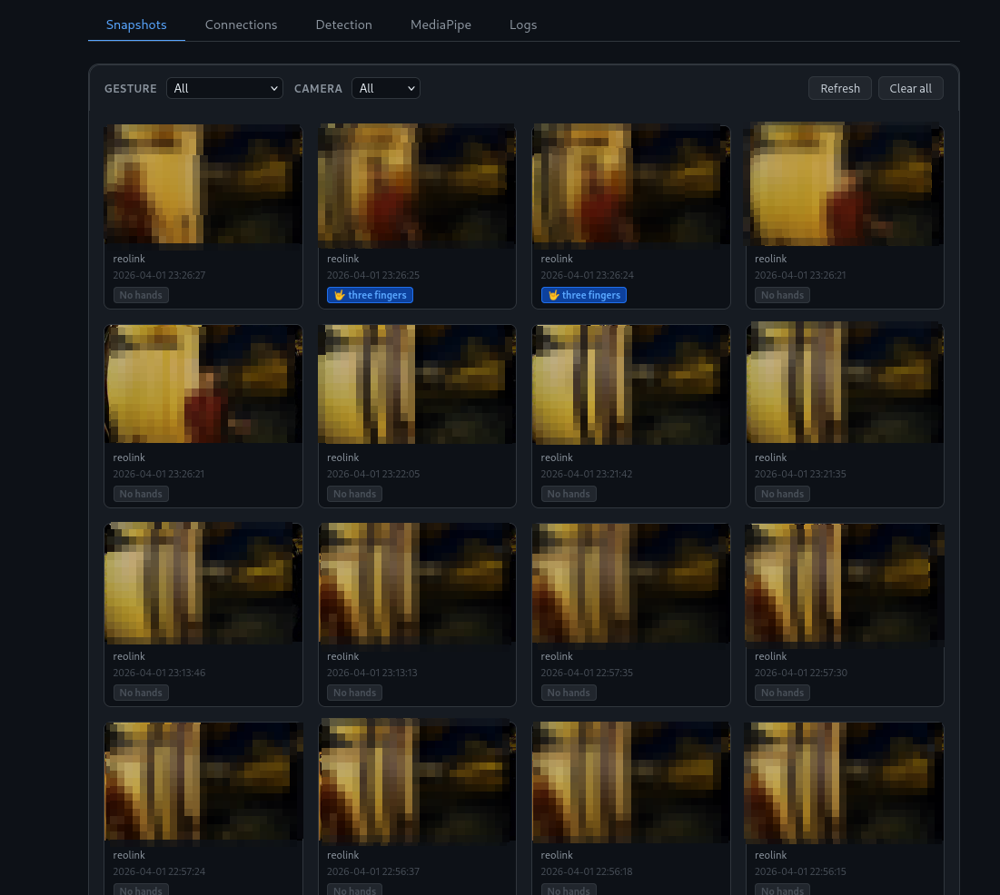

> [!NOTE]
> This App is almost completely Vibed Coded. I wanted to have a simple interface for Hand Recognition and [Double Take](https://github.com/skrashevich/double-take) wasn't really working for me. After understanding the problem at hand, I noticed that the project structure was going to be very simple, so I gave Claude a shot.
> I made this app for my personal use, but I am sharing it because it works perfectly for my use case, and maybe its useful for others.
> If you have an issue with the app being Vibe Coded, please refrain to make any comments. Thanks.

# Home Assistant Hand Recognition Add-on

Detects and classifies hand gestures from [Frigate](https://github.com/blakeblackshear/frigate) camera snapshots using [MediaPipe](https://github.com/google-ai-edge/mediapipe).
When a gesture is recognized, it publishes the result to an MQTT topic so Home Assistant automations can react to it.



## Installation

1. In Home Assistant, go to **Settings > Add-ons > Add-on Store**.
2. Click the menu (top right) and select **Repositories**.
3. Add: `https://github.com/benja-opazo/home-assistant-hand-recognition`
4. Install the **Hand Recognition** add-on and start it.
5. Open the web UI from the add-on page to configure connections and detection settings.

> [!TIP]
> The installation takes a while, because the Home Assistant has to build the Docker image. Be patient

## Configuration

The web UI has five tabs:

| Tab | Purpose |
|-----|---------|
| Snapshots | Grid of captured snapshots with gesture and camera filters. Supports single download/delete per card, and multi-select for bulk delete or ZIP download. |
| Connections | MQTT broker credentials, Frigate URL, snapshot mode (event vs. latest frame), and output topic template. |
| Detection | MQTT topic to subscribe to, plus configurable message filters (property, comparator, value) for routing events. |
| MediaPipe | Toggle individual gestures on/off and adjust model settings (confidence threshold, max hands, model complexity). |
| Logs | Live log stream with level and source filters, pause, clear, and download. |

The default configuration should work out of the box, except for the MQTT credentials that have to be configured.

## MQTT Output

When a gesture is detected, the add-on publishes to the configured topic (default: `hand-recognition/{camera}`):

```json
{
  "camera": "front_door",
  "detections": [
    {
      "gesture": "open_palm",
      "score": 0.97,
      "hand": "Right"
    }
  ]
}
```

If no hands are detected in the snapshot, **nothing is published**.

## Supported Gestures

These are the values that appear in the `gesture` field of the MQTT payload.

| Value | Description |
|-------|-------------|
| `fist` | All fingers curled, closed fist |
| `thumbs_up` | Thumb extended, all other fingers curled |
| `pointing` | Index finger extended, all others curled |
| `peace` | Index and middle fingers extended (V sign) |
| `open_palm` | All five fingers extended |
| `four_fingers` | Index, middle, ring, and pinky extended, thumb curled |
| `three_fingers` | Index, middle, and ring fingers extended |
| `rock_on` | Index and pinky extended, thumb out (horns sign) |
| `call_me` | Thumb and pinky extended, other fingers curled |
| `pinky` | Pinky finger only extended |
| `unknown` | A hand was detected but the finger combination did not match any of the above |

## Home Assistant Automation Example

The following automation turns on a light when an open palm is detected on the front door camera.

```yaml
alias: Open palm detected on front door by Recognized Person
triggers:
  - topic: hand-recognition/front-door
    trigger: mqtt
conditions:
  - condition: template
    value_template: >-
      {{ trigger.payload_json.detections[0].gesture in ['open_palm',
      'four_fingers', 'three_fingers'] }}
action:
  - service: light.turn_on
    target:
      entity_id: light.front_porch
mode: single
```

Notice that in the previous configuration, the camera name in  `hand-recognition/<camera_name>` is obtained from the Frigate MQTT Notification, which is obtained from the camera configuration. This is usefull if there are more than one camera added to the Frigate App and some actions (e.g.: open palm, open front door) are place specific.

To act on any gesture from any camera, use a wildcard topic and reference the camera and gesture from the payload:

```yaml
alias: Log any hand gesture
trigger:
  - platform: mqtt
    topic: hand-recognition/#
action:
  - service: notify.persistent_notification
    data:
      message: >
        {{ trigger.payload_json.detections[0].gesture }}
        detected on {{ trigger.payload_json.camera }}
mode: queued
max: 10
```
